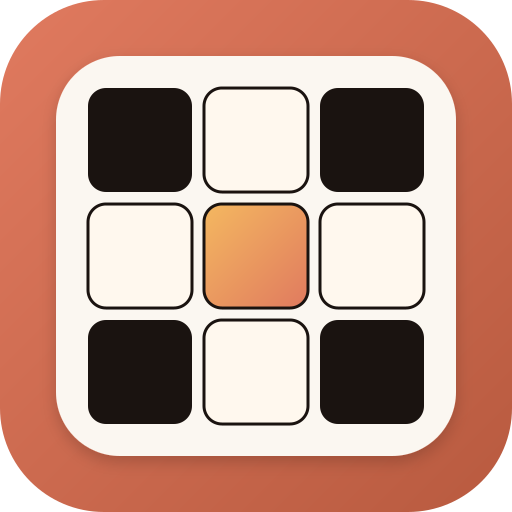
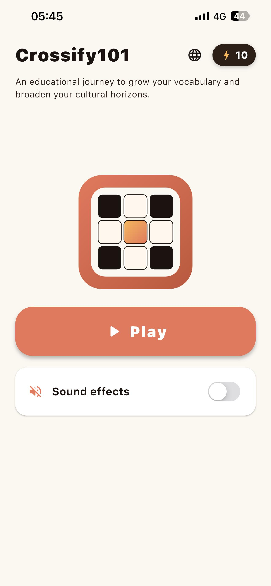
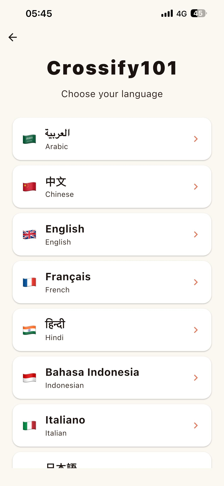
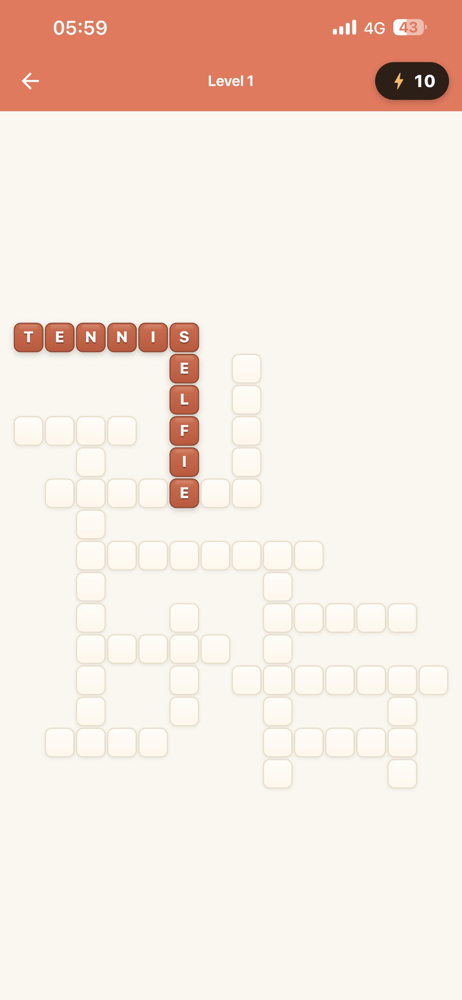
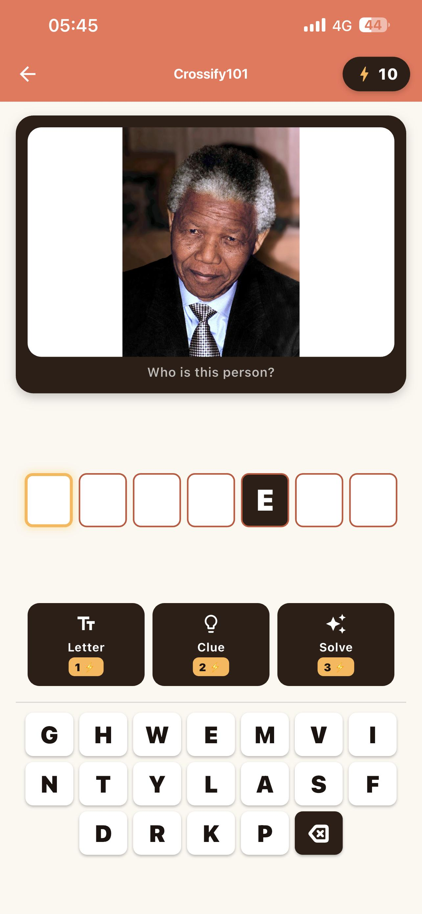
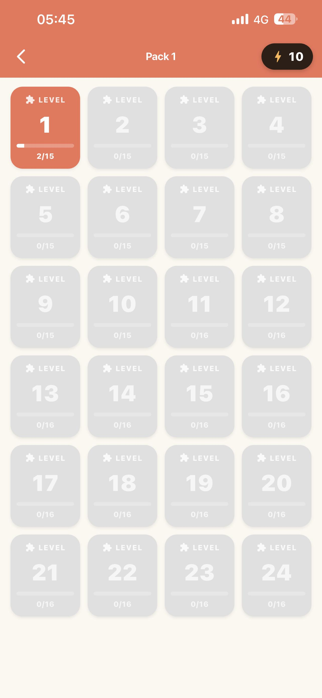
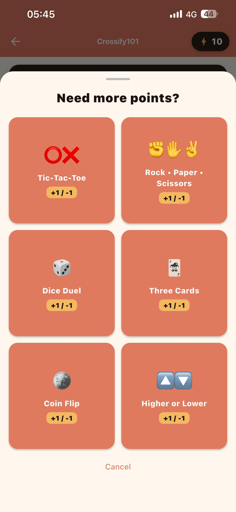
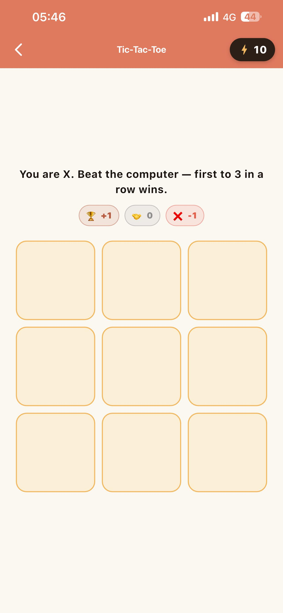
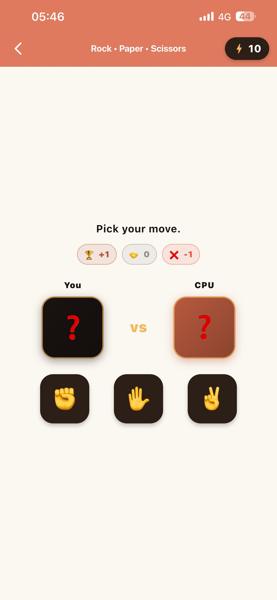
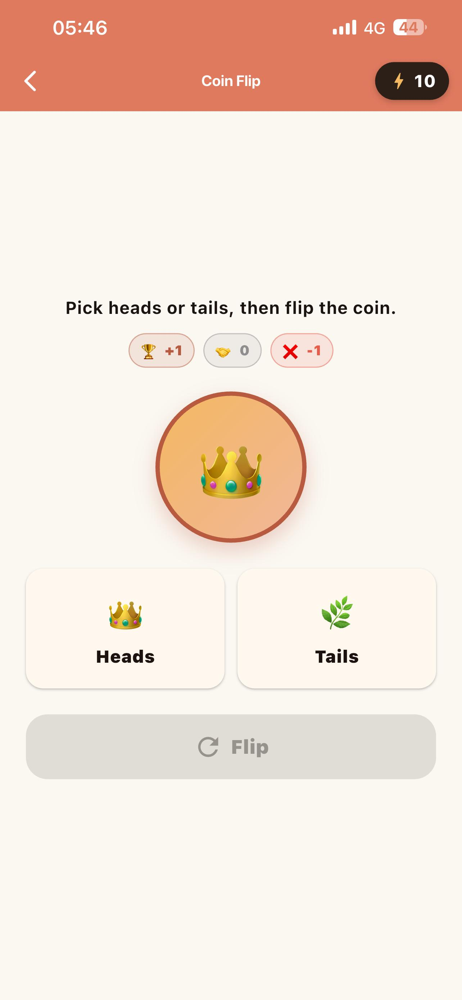

# Crossify101

### Offline word puzzles in 12 languages — grow your vocabulary *and* your cultural knowledge.

Crosswords that mix **picture clues** and **knowledge questions**. No ads. No internet. No tracking.

 

 

&nbsp;

---

## ✨ What is Crossify101?

Crossify101 is an **offline crossword game** that teaches as you play. Every puzzle blends two kinds of clues — **real photos to identify** and **knowledge questions to answer** — so you pick up people, places, science and language with every level you solve.

It runs without an internet connection, never asks for a single permission, and includes **zero** tracking or ads.

---

## 🎮 Features

| | |
|---|---|
| 🖼️ **Pictures & questions** | Most clues are knowledge questions and definitions across science, history, geography, nature and sports — woven with image clues: identify a flag, a face, a landmark, a painting or an animal from a real photo. |
| 🌍 **12 languages** | Each language has its own **24 themed packs**, its own letter picker matched to the script, and its own independent progress and points. |
| ⚡ **Points & mini-games** | Spend points on three tiers of hint when you're stuck. Running low? Win them back in quick mini-games. |
| 📚 **Learn while you play** | Every answer is a real word, name, place or fact worth knowing — hundreds per language, never like a textbook. |
| 📈 **Grows with you** | 24 packs ramp from easy starters to harder vocabulary and tougher trivia. The letter bank only ever shows the letters you actually need. |
| 🔒 **Private by design** | No network, no permissions, no analytics, no ads. Nothing leaves your device. |

---

## 📱 Screenshots

### Mini-games

---

## ⚡ Points, hints & mini-games

Every language starts you with a **10-point welcome bonus**. Spend points on three tiers of hint when you're stuck:

| Hint | Cost |
|---|---|
| Reveal one letter | **1 point** |
| Reveal the written clue | **2 points** |
| Reveal the whole word | **3 points** |

Running low? Win the points back in a quick mini-game — **tic-tac-toe, rock-paper-scissors, dice roll, three cards, coin flip** or **higher-or-lower**. It's a self-contained little economy, with nothing to buy and nothing to download.

---

## 🌍 Languages

Play in any of these — each fully self-contained with its own packs and progress:

🇸🇦 Arabic &nbsp;•&nbsp; 🇨🇳 Chinese &nbsp;•&nbsp; 🇬🇧 English &nbsp;•&nbsp; 🇫🇷 French &nbsp;•&nbsp; 🇮🇳 Hindi &nbsp;•&nbsp; 🇮🇩 Indonesian &nbsp;•&nbsp; 🇮🇹 Italian &nbsp;•&nbsp; 🇯🇵 Japanese &nbsp;•&nbsp; 🇵🇹 Portuguese &nbsp;•&nbsp; 🇷🇺 Russian &nbsp;•&nbsp; 🇪🇸 Spanish &nbsp;•&nbsp; 🇹🇷 Turkish

---

## 🔒 Privacy by design

Crossify101 collects **nothing**. Truly nothing.

- **Zero network** — the app has no HTTP stack; it can't phone home.
- **Zero permissions** — no camera, mic, location, contacts or storage.
- **Zero tracking** — no analytics, ads, crash or attribution SDKs.
- **On-device only** — all progress lives in one local, sandboxed file; cloud backup and device-transfer are disabled.

Read the full [Privacy Policy](privacy.html).

---

## 📥 Get the app

&nbsp;

Free • Rated 4+ • Works fully offline

> **Note:** the App Store link points to the real listing (App Apple ID `6771224286`). It will go live once Apple approves the app.

---

## 📨 Contact

Questions or feedback? Email **[mourad.ghafiri38@gmail.com](mailto:mourad.ghafiri38@gmail.com)**.

© 2026 Mourad Ghafiri. All rights reserved.

